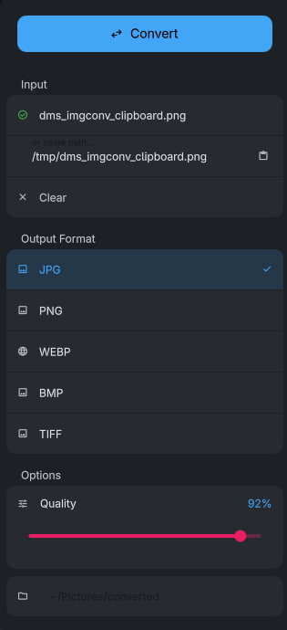

# Image Converter

A [DankMaterialShell](https://danklinux.com) plugin to convert images between formats without leaving your desktop.



Drop a file, paste a path, or let it pick up whatever is in your clipboard. Choose a format, tweak quality if needed, and hit Convert.

---

## Supported formats

**Output:** JPG · PNG · WEBP · BMP · TIFF

**Input:** all of the above + GIF

GIF files are accepted as input and converted to any of the output formats using [ImageMagick](https://imagemagick.org). Since GIF can be animated, only the first frame is extracted during conversion. Useful for grabbing a still from a GIF without needing a separate tool.

## Getting images in

There are three ways to feed the widget an image:

- **Drag and drop** a file onto the drop zone
- **Type or paste a path** into the text field
- **Clipboard**: the widget checks your clipboard automatically every 2 seconds while open, or you can trigger it manually with the button. It handles image data, `file://` URIs, and plain file paths.

## Output

Converted files land in your configured output directory (`~/Pictures/converted` by default). A few things happen automatically:

- For JPG and WEBP, the quality value is baked into the filename (`photo_q85.jpg`), so you always know what you're looking at.
- If a file with the same name already exists, a number is appended (`photo_q85(1).jpg`, etc.) instead of overwriting.
- The output directory is created if it doesn't exist.

## Quality

The quality slider (10–100%) only appears for lossy formats (JPG and WEBP). Lossless formats have no slider.

---

## Installation

### 1. Install dependencies

**Arch:**
```bash
sudo pacman -S imagemagick wl-clipboard
```

**Debian/Ubuntu:**
```bash
sudo apt install imagemagick wl-clipboard
```

Requires ImageMagick 7+ (`magick` in PATH) and `wl-paste` for clipboard support.

### 2. Install the plugin

Via the DMS Plugin Browser, or manually:

```bash
cd ~/.config/DankMaterialShell/plugins/
git clone https://github.com/murilo-gotardo/dms-image-converter.git ImageConverter
```

Reload DMS to activate.

---

## Settings

| Setting | Default | Description |
|---|---|---|
| Output Directory | `~/Pictures/converted` | Where converted files are saved |
| Default Format | `jpg` | Format selected when the widget opens |
| Default Quality | `92` | Starting quality for lossy formats |

---

## Credits

Image processing powered by [ImageMagick](https://imagemagick.org). An open source suite for image manipulation, used here via the `magick` CLI.

## License

MIT
